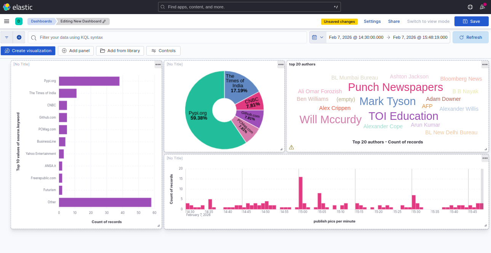
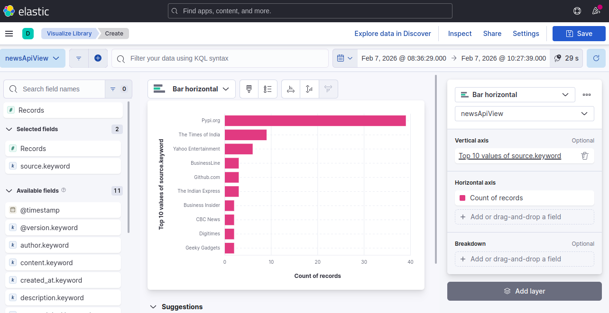

# NEWStreamer 

**NEWStreamer** is a real-time news streaming pipeline that ingests technology-related articles from NewsAPI every 5 minutes, streams them through Kafka, processes them with Logstash, indexes them in Elasticsearch for search and analytics via Kibana, and is designed to be extended with Spark or Hadoop for large-scale processing and advanced analytics.

**Pipeline overview:**
NewsAPI → Kafka → Logstash → Elasticsearch → Kibana → Spark (Batch Analytics)
---

## 📌 TL;DR / Index

- [Project Overview](#project-overview)
- [Architecture & Design Choices](#architecture--design-choices)
  - [1. NewsAPI – Data Source](#1-newsapi--data-source)
  - [2. Kafka – Streaming Layer](#2-kafka--streaming-layer)
  - [3. Logstash – Stream Processing](#3-logstash--stream-processing)
  - [4. Elasticsearch – Storage & Search](#4-elasticsearch--storage--search)
  - [5. Kibana – Visualization & Analytics](#5-kibana--visualization--analytics)
  - [6. Spark – Batch Analytics](#6-spark--batch-analytics)
- [Prerequisites](#prerequisites)
- [Steps to Launch the Project](#steps-to-launch-the-project)
- [Stopping the Pipeline](#stopping-the-pipeline)

---

## Project Overview

This project demonstrates a complete **real-time data engineering pipeline** built with widely used industry tools.  
It focuses on **continuous ingestion**, **stream processing**, **search and analytics**, and **scalability**.

The system periodically fetches news articles related to **technology, AI, and innovation**, streams them reliably through Kafka, processes them using Logstash, and stores them in Elasticsearch where they can be queried and visualized using Kibana dashboards.


## Architecture & Design Choices

### 1. NewsAPI – Data Source

**What it does**  
NewsAPI is used as the external data source providing real-world, continuously updated news articles.

**How it works**  
A Python Kafka producer queries the NewsAPI **`/v2/everything`** endpoint every **5 minutes (300 seconds)**.  
The query is configured to:
- Focus on **technology-related topics** (technology, AI, innovation)
- Use **English language articles** for consistent text analysis
- Fetch up to **100 articles per request**
- Sort articles by **publication date**
- Restrict results to the **last 7 days** to ensure relevance

**Why this choice**  
- Provides realistic unstructured text data
- Suitable for full-text search, fuzzy queries, and time-series analysis
- Free tier is sufficient for a streaming demo

Each fetched article is converted into a structured JSON message and sent to Kafka.

---

### 2. Kafka – Streaming Layer

**What it does**  
Kafka acts as the **central streaming backbone** of the pipeline.

**How it works**  
- The **Python producer** publishes messages to a predefined Kafka topic named **`newsapi`**
- Kafka stores messages in an append-only log
- Consumers can independently read the stream at their own pace

**Why Kafka**  
- Decouples data producers from consumers
- Provides fault tolerance and replayability
- Allows easy integration with multiple downstream systems (Logstash, Spark, etc.)

An interesting **Kafka consumer** script (independent from the pipeline) is also provided to manually inspect and experiment with streamed messages.

---

### 3. Logstash – Stream Processing

**What it does**  
Logstash consumes data from Kafka, applies transformations, and forwards it to Elasticsearch.

**How it works**  
Logstash subscribes to the `newsapi` Kafka topic and processes each message with the following logic:

- If the article contains a `published_at` field:
  - It is parsed as an ISO8601 date
  - Stored in the special `@timestamp` field
- Otherwise:
  - The `created_at` field is used as a fallback timestamp

This ensures that **all documents are time-aligned**, which is essential for time-series analysis and Kibana visualizations.

**Why Logstash**  
- Native Kafka integration
- Powerful filtering and transformation capabilities
- Designed for Elasticsearch ingestion

---

### 4. Elasticsearch – Storage & Search

**What it does**  
Elasticsearch stores indexed articles and enables fast search, aggregations, and analytics.

**Indexing strategy (configured in logstash output)**
- Monthly rolling indices: `newsapi-YYYY.MM`
This prevents indices from growing indefinitely and improves performance.

- Deterministic document IDs: `document_id = article URL`
This ensures **idempotent writes**:  
if NewsAPI returns the same article again, it updates the existing document instead of creating duplicates.

**Why this design**
- Scales well over time
- Avoids duplicate documents caused by periodic polling
- Aligns with Elasticsearch best practices

# Kibana & Spark Analytics

**Components:** Real-time Visualization (Kibana) + Batch Analytics (Apache Spark)

---

## 📊 Part 1: Kibana - Real-time Visualization

### Dashboards Created

#### 1. Full Analytics Dashboard

**File:** [`kibana/full_dashboard.png`](../kibana/full_dashboard.png)



**Visualizations:**

- **Top 10 Sources** (Horizontal Bar)
  - Field: `source.keyword`
  - Shows: Article count per source
  
- **Sources Distribution** (Pie Chart)
  - Field: `source.keyword`
  - Shows: Percentage breakdown (OpenAI.org 28.38%, Times of India 17.12%...)

- **Top 20 Authors** (Word Cloud)
  - Field: `author.keyword`
  - Highlights: Mark Tyson, Will Mccurdy, TOI Education...

- **Publish Rate Over Time** (Bar Chart)
  - X-axis: `@timestamp` (by minute)
  - Y-axis: Article count
  - Shows: Publication spikes and patterns

---

#### 2. Top 10 Active Sources

**File:** [`kibana/nb_of_news_per_top10_active_sources.png`](./kibana/nb_of_news_per_top10_active_sources.png)



- Type: Horizontal bar chart
- Field: `source.keyword`
- Purpose: Identify most active publishers

---

#### 3. Data Explorer View

**File:** [`kibana/data_view_created.png`](./kibana/data_view_created.png)


- Type: Table view with 102 documents
- Fields: @timestamp, author, content, source, title, url...
- Features: Search, filter, export

---

## ⚡ Part 2: Apache Spark - Batch Analytics

### Setup

```python
from pyspark.sql import SparkSession
from pyspark.sql.functions import col, count, to_date, length, avg, lower, explode, split

spark = SparkSession.builder \
    .appName("NewsAPI Spark Analysis") \
    .config("spark.jars", "/opt/spark/jars/elasticsearch-spark-30_2.12-8.12.0.jar") \
    .config("spark.es.nodes", "elasticsearch") \
    .config("spark.es.port", "9200") \
    .getOrCreate()

# Load data from Elasticsearch
df = spark.read \
    .format("org.elasticsearch.spark.sql") \
    .option("es.resource", "newsapi-*") \
    .load()
df.cache()
```

---

### Analytics Performed

#### 1. News by Source

**Code:**
```python
news_by_source = df.groupBy("source") \
    .agg(count("*").alias("nb_news")) \
    .orderBy(col("nb_news").desc())

news_by_source.coalesce(1).write \
    .mode("overwrite") \
    .option("header", "true") \
    .csv("spark/output/news_by_source")
```

**Output:** [`spark/output/news_by_source/part-00000-*.csv`](./spark/output/news_by_source/)

**Result:**
```csv
source,nb_news
TechCrunch,45
The Verge,38
Wired,32
```

**Screenshot:** [`spark/screenshots/news_by_source.png`](./spark/screenshots/news_by_source.png)

---

#### 2. News by Day

**Code:**
```python
news_by_day = df.withColumn("date", to_date("published_at")) \
    .groupBy("date") \
    .count() \
    .orderBy("date")

news_by_day.coalesce(1).write \
    .mode("overwrite") \
    .option("header", "true") \
    .csv("spark/output/news_by_day")
```

**Output:** [`spark/output/news_by_day/part-00000-*.csv`](./spark/output/news_by_day/)

**Result:**
```csv
date,count
2026-02-01,12
2026-02-02,18
2026-02-03,25
```

**Screenshot:** [`spark/screenshots/nb_of_news_by_day.png`](./spark/screenshots/nb_of_news_by_day.png)

---

#### 3. Top Authors

**Code:**
```python
top_authors = df.filter(col("author").isNotNull()) \
    .groupBy("author") \
    .count() \
    .orderBy(col("count").desc()) \
    .limit(20)

top_authors.coalesce(1).write \
    .mode("overwrite") \
    .option("header", "true") \
    .csv("spark/output/top_authors")
```

**Output:** [`spark/output/top_authors/part-00000-*.csv`](./spark/output/top_authors/)

**Result:**
```csv
author,count
Mark Tyson,42
Will Mccurdy,38
Adam Downer,35
```

**Screenshot:** [`spark/screenshots/top_authors.png`](./spark/screenshots/top_authors.png)

---

#### 4. Top Keywords

**Code:**
```python
# Tokenize titles into words
keywords = df.select(
    explode(split(lower(col("title")), " ")).alias("word")
)

# Filter: length > 4, exclude stop words
filtered_keywords = keywords.filter(
    (length(col("word")) > 4) &
    (~col("word").isin("about", "their", "there", "which", "would", "could", "https", "after"))
)

top_keywords = filtered_keywords.groupBy("word") \
    .count() \
    .orderBy(col("count").desc()) \
    .limit(20)

top_keywords.coalesce(1).write \
    .mode("overwrite") \
    .option("header", "true") \
    .csv("spark/output/top_keywords")
```

**Output:** [`spark/output/top_keywords/part-00000-*.csv`](./spark/output/top_keywords/)

**Result:**
```csv
word,count
technology,156
artificial,142
intelligence,138
```

**Screenshot:** [`spark/screenshots/top_keywords.png`](./spark/screenshots/top_keywords.png)

---

#### 5. Content Statistics

**Code:**
```python
content_stats = df.select(
    avg(length("content")).alias("avg_content_length"),
    avg(length("title")).alias("avg_title_length")
)

content_stats.coalesce(1).write \
    .mode("overwrite") \
    .option("header", "true") \
    .csv("spark/output/content_stats")
```

**Output:** [`spark/output/content_stats/part-00000-*.csv`](./spark/output/content_stats/)

**Result:**
```csv
avg_content_length,avg_title_length
2847.52,68.34
```

**Screenshot:** [`spark/screenshots/content_stats.png`](./spark/screenshots/content_stats.png)

---

### Output Structure

```
spark/
├── output/
│   ├── content_stats/part-00000-*.csv
│   ├── news_by_day/part-00000-*.csv
│   ├── news_by_source/part-00000-*.csv
│   ├── top_authors/part-00000-*.csv
│   └── top_keywords/part-00000-*.csv
└── screenshots/
    ├── content_stats.png
    ├── nb_of_news_by_day.png
    ├── news_by_source.png
    ├── reading_data_from_elasticsearch.png
    ├── top_authors.png
    └── top_keywords.png
```

---

## 🚀 Running the Spark Job

```bash
docker exec -it spark /opt/spark/bin/spark-submit \
  --master local[*] \
  --packages org.elasticsearch:elasticsearch-spark-30_2.12:8.11.0 \
  /app/news_analysis.py
```

**Expected output:**
```
Starting Spark job...
Reading data from Elasticsearch (newsapi-*)...
✓ News by source saved
✓ News by day saved
✓ Top authors saved
✓ Top keywords saved
✓ Content stats saved
Job completed successfully!
```

---

## 📊 Results Summary

| Analysis | Metric | Output |
|----------|--------|--------|
| **Source Volume** | Articles per source | Top: TechCrunch (45), The Verge (38) |
| **Daily Trends** | Articles per day | Peak: Feb 7 (45 articles) |
| **Author Ranking** | Most prolific authors | Top: Mark Tyson (42), Will Mccurdy (38) |
| **Trending Topics** | Top keywords in titles | technology (156), artificial (142), intelligence (138) |
| **Content Depth** | Avg lengths | Content: 2,848 chars, Title: 68 chars |

---

## 🎯 Key Insights

**Kibana (Real-time):**
- Live monitoring of news ingestion
- Interactive filtering and search
- Instant source/author analysis

**Spark (Batch):**
- Historical trend analysis
- Large-scale aggregations
- Keyword extraction and topic detection

---

## 📁 All Outputs

**Kibana Dashboards:**
- [`kibana/full_dashboard.png`](./kibana/full_dashboard.png)
- [`kibana/nb_of_news_per_top10_active_sources.png`](./kibana/nb_of_news_per_top10_active_sources.png)
- [`kibana/data_view_created.png`](./kibana/data_view_created.png)

**Spark CSV Results:**
- [`spark/output/news_by_source/`](./spark/output/news_by_source/)
- [`spark/output/news_by_day/`](./spark/output/news_by_day/)
- [`spark/output/top_authors/`](./spark/output/top_authors/)
- [`spark/output/top_keywords/`](./spark/output/top_keywords/)
- [`spark/output/content_stats/`](./spark/output/content_stats/)

**Spark Screenshots:**
- All visualizations in [`spark/screenshots/`](./spark/screenshots/)

---

**Last Updated:** February 2026

## **Prerequisites**

- Docker & Docker Compose installed
- Create `.env` file on root folder and add your NEWSAPI_KEY 
- Python 3.10+ (with `venv` recommended)
- Required Python packages:
```bash
pip install -r requirements.txt
```

---

## **Steps to launch the project**

1. Start the full pipline with Docker compose
```bash
docker compose up -d
```
2. Create a Kafka topic "newsapi"
```bash
docker exec -it kafka /opt/kafka/bin/kafka-topics.sh --create --topic newsapi --bootstrap-server localhost:9092
```
3. Verify that the topic exists
```bash
docker exec -it kafka /opt/kafka/bin/kafka-topics.sh --list --bootstrap-server localhost:9092
```
4. Launch the kafka producer
```bash
python kafka/kafka-producer-newsapi.py
```
5. Check Logstash is consuming
```bash
docker logs logstash --tail 50
```
6. Check ElasticSearch Indices
```bash
curl http://localhost:9200/_cat/indices?v
```
7. Explore Data in Kibana: http://localhost:5602

8. Run Spark batch analytics (after data is indexed in Elasticsearch)
```bash
docker exec -it spark /opt/spark/bin/spark-submit /app/news_analysis.py
```

## **Stopping the pipeline**

9. To Stop all containers (data saved inside containers):
```bash
docker compose stop
```
10. To Stop & Delete all containers:
```bash
docker compose down -v
```
